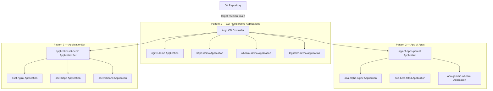

# GitOps and Argo CD Reference Architectures

## Overview

This section documents three progressive Argo CD deployment patterns, implemented and validated on a standalone Kubernetes cluster running on AWS EC2. Each pattern addresses a different layer of GitOps architecture: direct Application management, hierarchical app composition, and scalable app generation.

The implementations cover the full operational lifecycle: initial synchronisation, drift detection, self-healing, rollback, failure injection, and recovery. They are not documentation-only examples — each pattern has been deployed, tested through positive and negative scenarios, and documented with operational detail.

A full live-demo runbook is available at [argocd-demo-runbook.md](./argocd-demo-runbook.md), covering a structured 60-minute walkthrough with presenter notes and timed segments.

---

## Architecture

The three patterns form a natural progression of GitOps complexity and scalability.



Each pattern synchronises Kubernetes workloads from Git-managed manifests under the corresponding `k8s/` subdirectory.

---

## Key Concepts

**Argo CD Application CRD**
The core Argo CD resource. Binds a Git source (repository, path, revision) to a cluster destination (server, namespace). Manages synchronisation state and health reporting.

**Sync Policy**
Controls whether Argo CD synchronises automatically on Git changes (`automated`) or waits for a manual trigger (`manual` or `none`). Automated sync can be combined with `selfHeal` and `prune`.

**Self-Heal**
When enabled, Argo CD detects cluster-side drift (changes made outside Git) and reverts the cluster to match the Git-defined desired state. This is the enforcement mechanism for GitOps.

**Prune**
Controls whether resources removed from Git are also deleted from the cluster. Without prune, deleted Git resources are left orphaned in the cluster.

**App of Apps Pattern**
A parent Application points to a directory of child Application manifests. Argo CD deploys the parent, which in turn deploys all child Applications. Provides hierarchical control — managing the parent manages the entire tree.

**ApplicationSet**
A separate CRD with its own controller. Combines a template with a generator (list, Git directory, cluster, matrix, etc.) to produce multiple Applications automatically. Adding an entry to the generator produces a new Application without writing a new YAML file.

**OutOfSync / Synced / Healthy / Degraded**
Argo CD tracks two independent dimensions: sync state (does the cluster match Git?) and health state (are workload resources healthy?). Understanding the difference between these is essential for effective troubleshooting.

---

## Repository Structure

```text
argocd-reference-architectures/
├── cli-demo/
│   ├── argocd/                         # Argo CD Application manifests (declarative)
│   │   ├── nginx-demo-app.yaml         # NodePort 30095
│   │   ├── httpd-demo-app.yaml         # ClusterIP
│   │   ├── whoami-demo-app.yaml        # NodePort 30096, 2 replicas
│   │   └── logstorm-demo-app.yaml      # Log-generating workload, no service
│   └── k8s/                            # Raw Kubernetes manifests per application
│       ├── nginx-demo/
│       ├── httpd-demo/
│       ├── whoami-demo/
│       └── logstorm-demo/
├── app-of-apps-demo/
│   ├── argocd/
│   │   ├── app-of-apps-parent.yaml     # Parent Application — manages the children directory
│   │   └── children/
│   │       ├── alpha-nginx-app.yaml    # Child: aoa-alpha-nginx namespace
│   │       ├── beta-httpd-app.yaml     # Child: aoa-beta-httpd namespace
│   │       ├── gamma-whoami-app.yaml   # Child: aoa-gamma-whoami namespace
│   │       └── kustomization.yaml      # Controls which child Applications are managed
│   └── k8s/
│       ├── alpha-nginx/
│       ├── beta-httpd/
│       └── gamma-whoami/
└── applicationset-demo/
    ├── argocd/
    │   └── applicationset-demo.yaml    # List generator — produces aset-nginx, aset-httpd, aset-whoami
    └── k8s/
        ├── aset-nginx/
        ├── aset-httpd/
        └── aset-whoami/
```

---

## Prerequisites

| Requirement | Detail |
|---|---|
| Kubernetes cluster | A running cluster with `kubectl` access. Validated on a standalone cluster on EC2. |
| Argo CD | Installed in the `argocd` namespace. |
| `kubectl` | Configured with cluster access. |
| `argocd` CLI | Authenticated against the cluster's Argo CD instance. |
| Git repository | Manifests pushed to the branch specified in `targetRevision` (default: `main`). |
| Repository access | Argo CD must have read access to the Git repository. |

Quick pre-flight check:

```bash
kubectl get ns argocd
kubectl get pods -n argocd
argocd version --short
argocd app list
```

---

## Implementation Flow

### Pattern 1 — CLI and Declarative Application Management

This pattern demonstrates the foundational Argo CD model: creating Applications either imperatively via the CLI or declaratively by applying Application manifests from Git.

**Imperative creation (CLI):**

```bash
argocd app create nginx-demo \
  --repo https://github.com/<owner>/<repo>.git \
  --path argocd-reference-architectures/cli-demo/k8s/nginx-demo \
  --dest-server https://kubernetes.default.svc \
  --dest-namespace nginx-demo \
  --sync-option CreateNamespace=true \
  --sync-policy none

argocd app get nginx-demo
argocd app sync nginx-demo
```

**Declarative creation (GitOps-style):**

```bash
kubectl apply -f argocd-reference-architectures/cli-demo/argocd/whoami-demo-app.yaml
argocd app get whoami-demo
```

Both approaches produce the same Application resource. In practice, declarative creation via Git is preferred because it keeps the Application definition under version control.

### Pattern 2 — App of Apps

Apply only the parent Application. Argo CD discovers and deploys the child Applications defined in the `children/` directory.

```bash
kubectl apply -f argocd-reference-architectures/app-of-apps-demo/argocd/app-of-apps-parent.yaml
kubectl get applications -n argocd
kubectl get all -n aoa-alpha-nginx
kubectl get all -n aoa-beta-httpd
kubectl get all -n aoa-gamma-whoami
```

The `kustomization.yaml` in the `children/` directory controls which child Applications the parent manages.

### Pattern 3 — ApplicationSet

Apply the ApplicationSet manifest using `kubectl`. Argo CD's ApplicationSet controller reads the list generator and creates one Application per entry.

```bash
kubectl apply -f argocd-reference-architectures/applicationset-demo/argocd/applicationset-demo.yaml
kubectl get applicationset -n argocd
argocd app list | grep aset-
```

---

## Validation

**Confirm sync and health status:**

```bash
kubectl get applications -n argocd
argocd app get <app-name>
```

**Confirm workloads are running:**

```bash
kubectl get all -n nginx-demo
kubectl get all -n aoa-alpha-nginx
kubectl get all -n aset-nginx
```

**Verify NodePort-exposed applications (on the cluster node):**

```bash
curl -s http://localhost:30095      # nginx-demo
curl -s http://localhost:30096      # whoami-demo
```

**Inspect diff between Git and live cluster:**

```bash
argocd app diff nginx-demo
```

---

## Failure and Recovery Scenarios

The following scenarios are implemented and documented in the [argocd-demo-runbook.md](./argocd-demo-runbook.md).

### Drift detection and self-heal

Manually scale a deployment in the cluster to create drift:

```bash
kubectl scale deploy/nginx-demo -n nginx-demo --replicas=5
argocd app get nginx-demo          # OutOfSync reported
```

With self-heal enabled, Argo CD reverts the replicas automatically. Without it, the drift is reported but not corrected until a manual sync.

```bash
argocd app set nginx-demo --sync-policy automated --self-heal
kubectl scale deploy/nginx-demo -n nginx-demo --replicas=5
sleep 8
kubectl get deploy nginx-demo -n nginx-demo   # reverts to 3
```

### Automated sync from a Git commit

```bash
sed -i 's/replicas: 3/replicas: 4/' argocd-reference-architectures/cli-demo/k8s/nginx-demo/deployment.yaml
git add -A && git commit -m "scale nginx to 4" && git push
argocd app get nginx-demo --refresh
```

### Prune — deletion propagated from Git

```bash
argocd app set nginx-demo --sync-policy automated --self-heal --auto-prune
git rm argocd-reference-architectures/cli-demo/k8s/nginx-demo/service.yaml
git commit -m "remove nginx service" && git push
argocd app get nginx-demo --refresh
kubectl get svc -n nginx-demo      # service is gone
```

### App of Apps — removing a child

Remove a child filename from `kustomization.yaml` and push. The parent detects the change and stops managing that child Application. With prune enabled, the Application and its workloads are deleted.

### ApplicationSet — blast radius isolation

Break the path for one entry in the list generator. Only that generated Application fails. The others remain Healthy, demonstrating that ApplicationSet isolates failures to the affected entry.

### App of Apps vs ApplicationSet — scaling comparison

Adding a 4th app to App of Apps requires writing a new Application YAML file. Adding a 4th app to ApplicationSet requires adding three lines to the list generator. This contrast is a key architectural decision point for teams choosing between the two patterns.

---

## Architecture Decisions

**Why three separate patterns rather than one?**
Each pattern solves a different problem. CLI-managed Applications are suitable for small, individually curated deployments. App of Apps is appropriate for a known, limited set of applications where each needs individual YAML-level control. ApplicationSet is appropriate when many similar Applications need to be generated, scaled, or distributed across environments or clusters. Understanding when to use each is the learning objective.

**Why is `targetRevision: main` used?**
Pinning to `main` ensures that every merged commit triggers a reconciliation cycle. In production, pinning to a specific tag or commit SHA is preferred to prevent unintended deployments from direct pushes to the default branch.

**Why separate namespaces per application?**
Namespace isolation provides a clear boundary for access control, resource quotas, and blast-radius containment. A failing workload in one namespace does not affect workloads in another.

**Why is prune disabled by default?**
Prune is a destructive operation. Enabling it by default increases the risk of accidental deletion from a bad commit. It should be explicitly enabled only when the team understands the implications and has rollback procedures in place.

**Why use `kustomization.yaml` for App of Apps children?**
Kustomize provides a declarative inventory of which child Application files are included. This makes the set of managed children explicit and auditable, and allows Argo CD to detect when children are removed.

---

## Production Considerations

**Repository access and credentials**
In production, Argo CD accesses the Git repository using SSH keys or HTTPS credentials managed through Argo CD's secret store, not hardcoded in Application manifests. Credential rotation should be part of the operational runbook.

**RBAC and multi-tenancy**
Argo CD supports project-level RBAC to restrict which teams can deploy to which namespaces and clusters. In a multi-team environment, each team should have its own Argo CD project with scoped permissions.

**Target revision strategy**
For production workloads, `targetRevision` should point to a specific Git tag or release branch rather than `main`. This prevents a direct push from triggering an unreviewed deployment.

**Self-heal and prune in production**
Both self-heal and prune should be deliberate decisions. Self-heal is generally safe to enable as it enforces GitOps correctness. Prune requires confidence in Git as the authoritative source of truth and should be introduced incrementally.

**ApplicationSet generators in production**
The list generator used here is the simplest option. For production use, the Git directory generator (one app per folder) or the cluster generator (one app per registered cluster) reduces manual list maintenance and scales better.

**High availability**
In production, Argo CD itself should be deployed with multiple replicas and persistent storage for its state. The single-instance setup used in this implementation is not suitable for production without modifications.

**Secrets**
Application secrets must not be stored in Git. Use Argo CD with an external secrets operator (e.g., External Secrets Operator with AWS Secrets Manager or HashiCorp Vault) or Sealed Secrets for GitOps-compatible secret management.

---

## Learning Outcomes

After working through all three patterns, an engineer or architect should be able to:

- Explain the Argo CD Application CRD and its relationship to Git and the cluster
- Understand sync state, health state, and the difference between them
- Implement and operate all three deployment patterns
- Design a GitOps application inventory strategy appropriate for the size and complexity of the platform
- Execute controlled changes through Git and validate the outcome in Argo CD
- Detect, investigate, and recover from drift, failed syncs, and degraded applications
- Articulate the trade-offs between CLI-managed Apps, App of Apps, and ApplicationSets
- Apply self-heal, prune, and automated sync deliberately and safely

---

## Related Documentation

- [Repository overview](../README.md)
- [Argo CD live demo runbook](./argocd-demo-runbook.md)
- [Terraform infrastructure patterns](../terraform/README.md)
