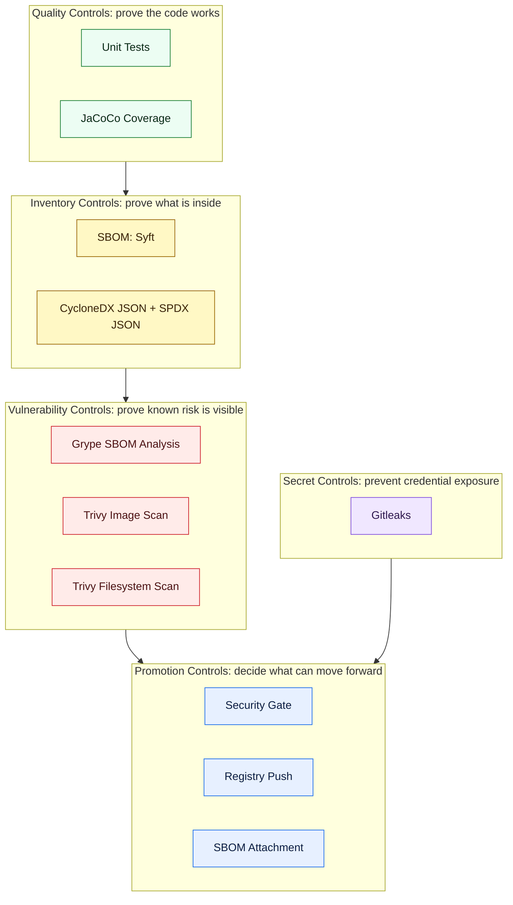
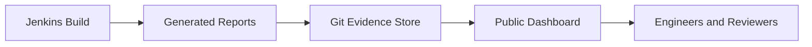

# Supply Chain Security Reference Architecture

This reference architecture shows how to design a secure container delivery pipeline from source code to registry publication, with security evidence generated at every important control point.

[](https://htmlpreview.github.io/?https://github.com/Github-Arun-Repo/platform-engineering-reference-architectures/blob/main/docs/security-reports/index.html)

The focus is not simply "run CI/CD." The focus is the **security supply chain** around modern software delivery:

- prove the code was tested
- prove the build produced an auditable artifact
- prove the container image was inspected
- prove dependencies and packages are inventoried
- prove secrets were not committed
- prove vulnerability gates ran before registry promotion
- publish evidence so engineers can inspect the result without Jenkins access

## Contents

1. [Architecture Intent](#architecture-intent)
2. [End-to-End Supply Chain](#end-to-end-supply-chain)
3. [Pipeline Control Map](#pipeline-control-map)
4. [Evidence Model](#evidence-model)
5. [Tool Reference Library](#tool-reference-library)
6. [Stage Navigator](#stage-navigator)
7. [1. Source and Checkout](#1-source-and-checkout)
8. [2. Unit Tests](#2-unit-tests)
9. [3. Code Coverage](#3-code-coverage)
10. [4. SAST and Code Quality](#4-sast-and-code-quality)
11. [5. Package Application](#5-package-application)
12. [6. Build Container Image](#6-build-container-image)
13. [7. Generate SBOM](#7-generate-sbom)
14. [8. Scan SBOM](#8-scan-sbom)
15. [9. Scan Container Image](#9-scan-container-image)
16. [10. Scan Filesystem](#10-scan-filesystem)
17. [11. Scan Secrets](#11-scan-secrets)
17. [12. Publish Report Evidence](#12-publish-report-evidence)
18. [13. Apply Security Gates](#13-apply-security-gates)
19. [14. Push to Registry](#14-push-to-registry)
20. [15. Sign Image](#15-sign-image)
21. [16. Attest Image](#16-attest-image)
22. [17. Attach SBOM](#17-attach-sbom)
23. [18. Publish Cosign Evidence](#18-publish-cosign-evidence)
24. [Reference Implementations](#reference-implementations)
25. [Runbooks vs Reference Guides](#runbooks-vs-reference-guides)
26. [Roadmap](#roadmap)

## Architecture Intent

This reference is for engineers designing secure build pipelines for containerized workloads.

It provides a reusable pattern for answering four architectural questions:

1. **What checks must happen before an image is promoted?**
2. **What evidence should be generated for each build?**
3. **Which findings should block delivery, and which should be reported?**
4. **How can teams inspect supply chain security output without depending on Jenkins UI access?**

The sample application is intentionally small. The important part is the supply chain around it.

## End-to-End Supply Chain

The architecture is designed as a chain of evidence. Each step either validates the artifact, enriches it with metadata, or decides whether it is allowed to move forward.

```mermaid
flowchart LR
    commit[01<br/>Developer Commit]
    checkout[02<br/>Checkout]
    tests[03<br/>Unit Tests]
    coverage[04<br/>Coverage]
    sonar[05<br/>SonarQube Optional]
    package[06<br/>Package App]
    image[07<br/>Build Image]
    sbom[08<br/>Generate SBOM]
    grype[09<br/>SBOM Risk Scan]
    trivyImage[10<br/>Image Scan]
    trivyFs[11<br/>Filesystem Scan]
    gitleaks[12<br/>Secret Scan]
    reportCommit[13<br/>Publish Report Evidence]
    gates[14<br/>Security Gates]
    registry[15<br/>Registry Push]
    sign[16<br/>Cosign Sign Optional]
    attest[17<br/>Cosign Attest Optional]
    attach[18<br/>Attach SBOM]
    cosignCommit[19<br/>Publish Cosign Evidence]
    evidence[20<br/>Evidence Dashboard]

    commit --> checkout --> tests --> coverage --> sonar --> package --> image --> sbom --> grype --> reportCommit --> gates --> registry --> sign --> attest --> attach --> cosignCommit --> evidence
    image --> trivyImage --> gates
    package --> trivyFs --> gates
    checkout --> gitleaks --> gates
    grype --> reportCommit
    trivyImage --> reportCommit
    trivyFs --> reportCommit
    gitleaks --> reportCommit
    reportCommit --> evidence
    cosignCommit --> evidence

    classDef source fill:#e7f0ff,stroke:#1f6feb,color:#0b1f44,stroke-width:1px;
    classDef quality fill:#ecfdf3,stroke:#1a7f37,color:#062b16,stroke-width:1px;
    classDef artifact fill:#fff8c5,stroke:#9a6700,color:#3b2300,stroke-width:1px;
    classDef security fill:#ffebe9,stroke:#cf222e,color:#4d1113,stroke-width:1px;
    classDef publish fill:#f6f8fa,stroke:#57606a,color:#24292f,stroke-width:1px;

    class commit,checkout source;
    class tests,coverage quality;
    class package,image,sbom artifact;
    class grype,trivyImage,trivyFs,gitleaks,gates,sign,attest security;
    class registry,reportCommit,attach,cosignCommit,evidence publish;
```



This is the core chain: code enters, controls run one after another, evidence is produced, and only approved artifacts move forward.

## Pipeline Control Map



Each control answers a different question. The pipeline uses several controls because no single scanner gives complete coverage.

## Evidence Model



Jenkins executes the pipeline. Git stores the published evidence. The dashboard provides the review surface.

Current dashboard:

- [Security Reports Dashboard](https://htmlpreview.github.io/?https://github.com/Github-Arun-Repo/platform-engineering-reference-architectures/blob/main/docs/security-reports/index.html)

## Tool Reference Library

The process diagram shows the supply chain. The tool reference explains the tool choices behind each control.

| Tool area | Chosen tool | Reference page | Why it is linked here |
|---|---|---|---|
| SAST and code quality | SonarQube | [SonarQube SAST](./tools/sonarqube-sast.md) | Explains why SonarQube is selected, how to install it on Kubernetes, demo vs licensed use, pricing signals, and SAST alternatives |
| Image signing and attestations | Cosign | [Cosign Signing](./tools/cosign-signing.md) | Explains the demo signing path, KMS and OIDC best-practice paths, and why digest signing plus attestations should happen after push |
| Supply chain tools catalog | Multiple tools | [Tools Reference](./tools/README.md) | Central place for tool categories, chosen tools, alternatives, and comparison approach |

## Stage Navigator

Click any stage to inspect what it does, why it exists, and where it is useful.

| Order | Stage | Tool | Used For | Gate |
|---:|---|---|---|---|
| 1 | [Source and Checkout](#1-source-and-checkout) | Git + Jenkins SCM | traceable source input | yes, if checkout fails |
| 2 | [Unit Tests](#2-unit-tests) | Maven Surefire + JUnit | behavior validation | yes |
| 3 | [Code Coverage](#3-code-coverage) | JaCoCo | coverage evidence | reported |
| 4 | [SAST and Code Quality](#4-sast-and-code-quality) | SonarQube | source-level security and maintainability | optional / planned |
| 5 | [Package Application](#5-package-application) | Maven | build JAR artifact | yes |
| 6 | [Build Container Image](#6-build-container-image) | Docker | immutable runtime artifact | yes |
| 7 | [Generate SBOM](#7-generate-sbom) | Syft | package inventory | reported |
| 8 | [Scan SBOM](#8-scan-sbom) | Grype | dependency/package CVEs | severity gated |
| 9 | [Scan Container Image](#9-scan-container-image) | Trivy image | image layer CVEs | reported |
| 10 | [Scan Filesystem](#10-scan-filesystem) | Trivy fs | source/build context scan | reported |
| 11 | [Scan Secrets](#11-scan-secrets) | Gitleaks | committed secret detection | yes |
| 12 | [Publish Report Evidence](#12-publish-report-evidence) | Jenkins + Git + HTML | public report publication before promotion | reported |
| 13 | [Apply Security Gates](#13-apply-security-gates) | Jenkins policy logic | promotion decision | yes |
| 14 | [Push to Registry](#14-push-to-registry) | Docker | artifact promotion | yes |
| 15 | [Sign Image](#15-sign-image) | Cosign | digest integrity proof | optional |
| 16 | [Attest Image](#16-attest-image) | Cosign | SBOM and build evidence referrers | optional |
| 17 | [Attach SBOM](#17-attach-sbom) | ORAS | OCI artifact attachment | best effort |
| 18 | [Publish Cosign Evidence](#18-publish-cosign-evidence) | Jenkins + Git + HTML | public signing and attestation evidence | optional |

## 1. Source and Checkout

**What happens**

Jenkins checks out the repository and pins the pipeline to a specific source revision.

**Why this matters**

Every downstream artifact must be traceable to source code. Without a clean source checkpoint, SBOMs, images, scan reports, and coverage output lose their audit value.

**Where this is useful**

- regulated build pipelines
- incident investigation
- artifact provenance
- rollback analysis

**Reference implementation**

- [Jenkinsfile](./phase-1-image-build-jenkins/Jenkinsfile)

## 2. Unit Tests

**What happens**

Maven Surefire runs JUnit tests for the Spring Boot sample application.

**Why this matters**

Unit tests catch broken behavior before the pipeline spends time creating images, SBOMs, and registry artifacts. This is the first functional quality gate.

**Where this is useful**

- API validation
- regression protection
- pull request checks
- release candidate validation

**Evidence produced**

- Surefire XML test reports
- Jenkins JUnit test result view

## 3. Code Coverage

**What happens**

JaCoCo generates coverage evidence from the unit test run.

**Why this matters**

Coverage does not prove quality by itself, but it shows which code paths are exercised by tests. It is useful evidence when reviewing release readiness and test depth.

**Where this is useful**

- release reviews
- quality dashboards
- pull request standards
- future SonarQube quality gates

**Evidence produced**

- [JaCoCo Coverage Report](https://htmlpreview.github.io/?https://github.com/Github-Arun-Repo/platform-engineering-reference-architectures/blob/main/docs/security-reports/jacoco/index.html)

## 4. SAST and Code Quality

**What happens**

SonarQube analyzes source code, imports JaCoCo coverage, evaluates code quality and security rules, and can publish a quality gate decision back to Jenkins.

**Why this matters**

SAST belongs before package and image promotion because source-level vulnerabilities and maintainability issues should be reviewed before the pipeline creates deployable artifacts.

**Where this is useful**

- Java service quality gates
- SAST evidence before image promotion
- code coverage governance
- security hotspot review
- future pull request checks

**Tool reference**

- [SonarQube SAST](./tools/sonarqube-sast.md)

## 5. Package Application

**What happens**

Maven packages the Spring Boot application into an executable JAR.

**Why this matters**

The JAR is the application artifact copied into the container image. A packaging failure should stop the pipeline before container build.

**Where this is useful**

- Java service builds
- release artifact creation
- reproducible application packaging

## 6. Build Container Image

**What happens**

Docker builds the final runtime image and tags it with the Jenkins build number and `latest`.

**Why this matters**

The image is the deployable unit. It must be immutable, traceable, and tested before promotion.

**Where this is useful**

- Kubernetes deployments
- GitOps release flows
- container registry promotion
- environment parity across dev, staging, and production

## 7. Generate SBOM

**What happens**

Syft scans the built image and generates a Software Bill of Materials.

**Formats used**

- CycloneDX JSON: primary SBOM format
- SPDX JSON: alternate exchange format
- Syft table: readable package inventory

**Why this matters**

An SBOM answers: "What is inside this artifact?" It creates the package inventory needed for vulnerability analysis, incident response, and compliance review.

**Where this is useful**

- vulnerability management
- vendor reviews
- compliance evidence
- incident response when a new CVE is announced

**Evidence produced**

- [SBOM Report](https://htmlpreview.github.io/?https://github.com/Github-Arun-Repo/platform-engineering-reference-architectures/blob/main/docs/security-reports/sbom-report.html)

## 8. Scan SBOM

**What happens**

Grype scans the CycloneDX SBOM and checks package inventory against known vulnerabilities.

**Why this matters**

SBOM scanning separates package inventory from vulnerability matching. This is useful because the same SBOM can be re-evaluated when vulnerability databases change.

**Where this is useful**

- dependency risk analysis
- build gates before registry push
- re-scanning historical artifacts
- CVE response workflows

**Current gate behavior**

- fails on configured severity findings
- currently configured for Critical findings
- operational scan errors are reported but do not block by default

**Evidence produced**

- [Grype SBOM Vulnerability Report](https://htmlpreview.github.io/?https://github.com/Github-Arun-Repo/platform-engineering-reference-architectures/blob/main/docs/security-reports/grype-report.html)

## 9. Scan Container Image

**What happens**

Trivy scans the final image for vulnerabilities in operating system packages and application dependencies visible in the image layers.

**Why this matters**

Image scanning checks the actual deployable artifact, not only the source tree. This catches risks introduced by base images, package managers, and runtime layers.

**Where this is useful**

- base image reviews
- container hardening
- registry admission policies
- runtime artifact validation

**Evidence produced**

- [Trivy Image Report](https://htmlpreview.github.io/?https://github.com/Github-Arun-Repo/platform-engineering-reference-architectures/blob/main/docs/security-reports/trivy-report.html)

## 10. Scan Filesystem

**What happens**

Trivy FS scans the application filesystem and build context.

**Why this matters**

This is the current lightweight replacement for OWASP Dependency-Check. It avoids the long NVD update behavior while still providing useful filesystem, dependency, secret, and misconfiguration visibility.

**Where this is useful**

- quick dependency checks
- source and build-context inspection
- misconfiguration review
- early feedback before registry promotion

**Evidence produced**

- [Trivy Filesystem Report](https://htmlpreview.github.io/?https://github.com/Github-Arun-Repo/platform-engineering-reference-architectures/blob/main/docs/security-reports/trivy-fs-report.html)

## 11. Scan Secrets

**What happens**

Gitleaks scans the repository for hardcoded credentials, keys, and tokens.

**Why this matters**

Secrets in source control are high-risk findings. If a secret is committed, the correct response is to fail the pipeline, rotate the credential, and remove the exposure.

**Where this is useful**

- repository protection
- pre-release validation
- credential hygiene
- audit evidence for secret scanning

**Evidence produced**

- [Gitleaks Secret Report](https://htmlpreview.github.io/?https://github.com/Github-Arun-Repo/platform-engineering-reference-architectures/blob/main/docs/security-reports/gitleaks-report.html)

## 12. Publish Report Evidence

**What happens**

Before the promotion gate is evaluated, Jenkins commits the latest report artifacts back into the repository and updates the public dashboard content.

**Why this matters**

This makes the security evidence visible even when a later gate blocks the release. Reviewers can inspect the exact build outputs without requiring Jenkins access.

**Where this is useful**

- release review preparation
- audit-friendly evidence publication
- engineering demos and walkthroughs
- failure analysis when promotion is blocked

## 13. Apply Security Gates

**What happens**

Jenkins evaluates scan results before pushing the image.

**Why this matters**

Security reports are useful, but gates decide whether an artifact is allowed to move forward.

**Current gate decisions**

- Gitleaks findings block the pipeline
- Grype findings at the configured threshold block the pipeline
- Grype operational errors warn by default
- Trivy image and filesystem scans publish evidence without blocking by default

**Where this is useful**

- progressive policy adoption
- release readiness decisions
- balancing security rigor with pipeline reliability

## 14. Push to Registry

**What happens**

The image is pushed to Docker Hub after required gates pass.

**Why this matters**

The registry should receive only artifacts that have passed the required quality and security checks.

**Where this is useful**

- Kubernetes deployments
- GitOps image promotion
- release candidate storage
- rollback to known-good images

**Follow-up controls**

After the image is pushed, the strongest next steps are to sign the immutable digest and attach attestations to it.

- [Cosign Signing](./tools/cosign-signing.md)

## 15. Sign Image

**What happens**

When Cosign is enabled, Jenkins signs the immutable pushed image digest after registry publication.

**Why this matters**

Signing proves integrity and gives downstream consumers a way to verify that the digest they are pulling is the one the pipeline intended to publish.

**Where this is useful**

- interview-friendly supply chain demos
- cluster admission verification
- release provenance and trust establishment

**Tool reference**

- [Cosign Signing](./tools/cosign-signing.md)

## 16. Attest Image

**What happens**

When Cosign is enabled, Jenkins creates attestations for the CycloneDX SBOM and build metadata predicate.

**Why this matters**

Attestations carry evidence about the artifact, not just a proof that the artifact was signed. This is where package inventory and build context become verifiable OCI referrers.

**Where this is useful**

- SBOM-linked release evidence
- policy engines consuming predicates
- downstream supply chain verification

**Tool reference**

- [Cosign Signing](./tools/cosign-signing.md)

## 17. Attach SBOM

**What happens**

ORAS attempts to attach the CycloneDX SBOM to the pushed image as an OCI artifact.

**Why this matters**

Attaching evidence to the artifact keeps inventory close to the image it describes. This is useful for registries and platforms that understand OCI artifact relationships.

**Current behavior**

This step is best effort. If ORAS or the registry attachment fails, the SBOM remains available as Jenkins artifacts and public dashboard evidence.

## 18. Publish Cosign Evidence

**What happens**

When Cosign is enabled, Jenkins publishes signing, verification, attestation, and referrer evidence into `docs/security-reports/` and exposes it through the same public dashboard.

**Why this matters**

Signing only helps if others can inspect and verify it. Publishing the evidence makes the signature flow visible and reviewable for other engineers.

**Where this is useful**

- architecture reviews
- release reviews
- audit preparation
- team enablement
- security exception discussions

**Evidence entry point**

- [Security Reports Dashboard](https://htmlpreview.github.io/?https://github.com/Github-Arun-Repo/platform-engineering-reference-architectures/blob/main/docs/security-reports/index.html)

## Reference Implementations

### Jenkins

Use this reference when you need:

- self-hosted execution
- Kubernetes-based build agents
- Jenkins credentials integration
- detailed stage-level operational visibility
- custom report publication back into Git

Files:

- [Jenkins reference](./phase-1-image-build-jenkins/)
- [Jenkinsfile](./phase-1-image-build-jenkins/Jenkinsfile)
- [Jenkins and SonarQube installation](./phase-1-image-build-jenkins/installation-jenkins.md)
- [Jenkins runbook](./phase-1-image-build-jenkins/jenkins-demo-runbook.md)

### GitHub Actions

Use this reference when you need:

- GitHub-native workflow execution
- managed runners
- simple source-control integrated CI
- lower platform setup overhead

Files:

- [GitHub Actions reference](./phase-1-image-build-github-actions/)

## Runbooks vs Reference Guides

Use this README for architecture reference.

Use the runbook for job execution.

| Document | Purpose |
|---|---|
| Main README | Architecture, control placement, diagrams, evidence model |
| Jenkins README | Jenkins-specific implementation details |
| Jenkins runbook | Installation checks, job execution, console inspection, troubleshooting |
| Sample app README | Application-specific context |

## Repository Map

```text
cicd-reference-architectures/
├── README.md
├── sample-application/
├── phase-1-image-build-jenkins/
│   ├── Jenkinsfile
│   ├── README.md
│   ├── installation-jenkins.md
│   └── jenkins-demo-runbook.md
├── phase-1-image-build-github-actions/
└── ../docs/security-reports/
```

## Roadmap

Planned additions:

1. admission-time verification of signatures and attestations
2. policy-based promotion using signed evidence
3. GitOps manifest update
4. environment promotion strategy
5. policy-as-code gates
6. license compliance reporting
7. admission controller integration
8. registry-native evidence discovery

## Quick Links

- [Security Reports Dashboard](https://htmlpreview.github.io/?https://github.com/Github-Arun-Repo/platform-engineering-reference-architectures/blob/main/docs/security-reports/index.html)
- [Tools Reference](./tools/README.md)
- [Cosign Signing Reference](./tools/cosign-signing.md)
- [SonarQube SAST Reference](./tools/sonarqube-sast.md)
- [Jenkins Reference](./phase-1-image-build-jenkins/)
- [Jenkins Runbook](./phase-1-image-build-jenkins/jenkins-demo-runbook.md)
- [GitHub Actions Reference](./phase-1-image-build-github-actions/)
- [Sample Application](./sample-application/)
- [Main Repository README](../README.md)