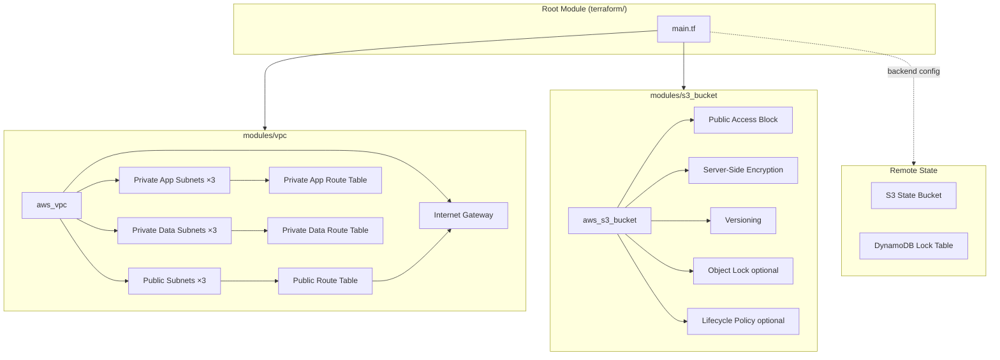

# Terraform Infrastructure Patterns

## Overview

This section contains modular Terraform for AWS infrastructure, designed around reusability, consistent security defaults, and remote state management. The current implementation provides a production-oriented multi-AZ VPC architecture and a reusable secure S3 bucket module with configurable encryption, versioning, lifecycle policies, and Object Lock.

The root module composes the available modules to provision a complete networking foundation and bucket resources from a single entry point, demonstrating how modular Terraform is structured and parameterised in practice.

---

## Architecture



The VPC module uses `for_each` over AZ–CIDR maps to create subnets, keeping the resource definitions DRY regardless of the number of AZs.

---

## Key Concepts

**Module composition**
The root module calls `module "vpc_network"` and two `module "secure_bucket_*"` instances. Each module is independently versioned and can be consumed by other root modules without modification.

**Multi-AZ subnet strategy**
Three subnet tiers are created across three AZs: public (internet-routable), private-app (workload tier), and private-data (database and storage tier). Tier separation enforces network segmentation at the subnet level.

**Remote state and locking**
State is stored in S3 with DynamoDB state locking. The backend block uses a partial configuration (`backend "s3" {}`) so that the actual bucket, key, and table names are supplied at `terraform init` time via `backend.hcl`. This prevents sensitive backend details from being committed to version control.

**Secure S3 bucket module**
The module enforces:
- `BucketOwnerEnforced` ownership (ACLs disabled)
- All public access blocked by default
- Server-side encryption (SSE-S3 by default, SSE-KMS when a key ARN is supplied)
- Versioning enabled by default
- Optional Object Lock with configurable GOVERNANCE or COMPLIANCE mode and retention period
- Optional lifecycle policy for incomplete multipart upload cleanup, object expiration, and noncurrent version expiration

**Input validation**
The VPC module validates that exactly three AZs and three CIDRs per tier are supplied. The S3 module validates `versioning_status` and `object_lock_mode` inputs. Validation at the module boundary prevents misconfiguration from propagating silently.

**Provider default tags**
The `provider "aws"` block applies `common_tags` as default tags to all resources. Individual resources merge additional name-specific tags on top.

---

## Repository Structure

```text
terraform/
├── main.tf                     # Root module — composes vpc and s3_bucket modules
├── variables.tf                # All input variable declarations with descriptions and validation
├── outputs.tf                  # Root outputs (VPC ID, subnet IDs, bucket names, etc.)
├── versions.tf                 # Terraform and provider version constraints, backend block
├── backend.hcl                 # Actual backend configuration (not committed — gitignored)
├── backend.hcl.example         # Reference example showing expected backend.hcl structure
├── terraform.tfvars            # Actual input values (not committed — gitignored)
├── terraform.tfvars.example    # Reference example showing expected variable values
└── modules/
    ├── vpc/
    │   ├── main.tf             # VPC, subnets, IGW, route tables, associations
    │   ├── variables.tf        # Module input variables
    │   └── outputs.tf          # VPC ID, subnet ID maps
    └── s3_bucket/
        ├── main.tf             # Bucket, encryption, versioning, Object Lock, lifecycle
        ├── variables.tf        # Module input variables with validation
        └── outputs.tf          # Bucket name, ARN, ID
```

---

## Prerequisites

| Requirement | Detail |
|---|---|
| Terraform | `>= 1.5.0` (defined in `versions.tf`) |
| AWS provider | `~> 5.0` (defined in `versions.tf`) |
| AWS credentials | An AWS identity with permissions to create VPC, subnet, IGW, route table, and S3 resources |
| S3 state bucket | An existing S3 bucket for Terraform state storage |
| DynamoDB lock table | An existing DynamoDB table for state locking |
| `backend.hcl` | Created from `backend.hcl.example` with actual bucket name, key, region, and table |
| `terraform.tfvars` | Created from `terraform.tfvars.example` with actual variable values |

---

## Implementation Flow

1. **Prepare backend configuration**

   ```bash
   cp backend.hcl.example backend.hcl
   # Edit backend.hcl with the actual S3 bucket, key path, region, and DynamoDB table
   ```

2. **Prepare variable values**

   ```bash
   cp terraform.tfvars.example terraform.tfvars
   # Edit terraform.tfvars with VPC CIDR, subnet CIDRs, AZ list, bucket names, and tags
   ```

3. **Initialise**

   ```bash
   terraform init -backend-config=backend.hcl
   ```

4. **Plan**

   ```bash
   terraform plan
   ```

   Review the plan output carefully. Verify subnet counts, AZs, CIDR ranges, bucket names, and encryption settings before proceeding.

5. **Apply**

   ```bash
   terraform apply
   ```

6. **Review outputs**

   ```bash
   terraform output
   ```

---

## Validation

After applying, verify the created resources in AWS:

```bash
# VPC
aws ec2 describe-vpcs --filters "Name=tag:Name,Values=<name-prefix>-vpc"

# Subnets
aws ec2 describe-subnets --filters "Name=vpc-id,Values=<vpc-id>" \
  --query 'Subnets[*].{AZ:AvailabilityZone,CIDR:CidrBlock,Name:Tags[?Key==`Name`]|[0].Value}' \
  --output table

# S3 buckets
aws s3api get-bucket-encryption --bucket <bucket-name>
aws s3api get-bucket-versioning --bucket <bucket-name>
aws s3api get-public-access-block --bucket <bucket-name>
```

Confirm in the Terraform output that VPC ID, subnet IDs, and bucket ARNs are present.

---

## Architecture Decisions

**Why use a partial backend configuration?**
The `backend "s3" {}` block in `versions.tf` is intentionally incomplete. Supplying the real S3 bucket name, state key, and DynamoDB table through `backend.hcl` at init time keeps those operational details out of version control and allows the same Terraform configuration to be used across multiple environments by providing different backend files.

**Why separate public, private-app, and private-data subnet tiers?**
Three tiers reflect a standard enterprise network segmentation pattern. Public subnets host load balancers and NAT gateways. Private-app subnets host application workloads. Private-data subnets host databases and storage, isolated from direct application network paths. This separation enables least-privilege security group and route table policies.

**Why is there no NAT gateway in this implementation?**
The current implementation does not include NAT gateways. Private subnets are truly isolated with no outbound internet path. For workloads in private subnets that require outbound internet access (OS updates, pulling images, etc.), NAT gateways should be added — one per AZ for HA. This is an explicit design decision documented here rather than an oversight.

**Why use `BucketOwnerEnforced` on S3 buckets?**
ACL-based access control on S3 is legacy behaviour. `BucketOwnerEnforced` disables ACLs entirely, requiring all access to be managed through bucket policies and IAM. This is the current AWS best practice for bucket ownership.

**Why provide both GOVERNANCE and COMPLIANCE Object Lock modes?**
GOVERNANCE allows administrators with specific IAM permissions to override the retention policy. COMPLIANCE is absolute — no one, including the root account, can delete or shorten the retention period during the lock period. The correct choice depends on the regulatory or audit requirements of the use case. The module exposes both options.

**Why use `for_each` over `count` for subnets?**
`for_each` uses a stable map key (the AZ name) to identify resources. `count` uses a positional index. Removing an AZ from the middle of a `count`-based list causes Terraform to re-index all subsequent resources, potentially destroying and recreating them. `for_each` avoids this.

---

## Production Considerations

**State security**
The S3 state bucket itself should have versioning, encryption, and public access block enabled. State files can contain sensitive outputs. Consider enabling S3 server-side encryption with KMS for the state bucket.

**State bucket access**
Restrict access to the state bucket using an S3 bucket policy. Only the CI/CD role and authorised operators should be able to read or write state.

**Least-privilege IAM**
The AWS identity used to run Terraform should have only the permissions required to manage the specific resources in scope. Avoid using administrator-level credentials for infrastructure automation.

**NAT gateway for private workloads**
If private-app or private-data subnets need outbound internet access, add NAT gateways — one per AZ to avoid cross-AZ traffic and a single point of failure.

**VPC flow logs**
Enable VPC flow logs to an S3 bucket or CloudWatch Logs group for network-level visibility and security investigation. This is not included in the current implementation and should be added for production use.

**Tagging strategy**
The `common_tags` variable applies consistent tags to all resources. In production, tags should include at minimum: environment, owner, cost-centre, and project identifiers. Tags drive cost attribution, access policy conditions, and operational tooling.

**Terraform version pinning**
Pin Terraform and provider versions precisely in production. The `~> 5.0` provider constraint allows minor version upgrades. For production, consider pinning to an exact provider version and upgrading deliberately with a plan review.

**Module versioning**
As the module library grows, modules should be versioned using Git tags and referenced by version rather than by local path. This prevents changes to a shared module from affecting unrelated root modules.

---

## Learning Outcomes

After working through this implementation, an engineer or architect should be able to:

- Explain Terraform module composition and how root modules consume child modules
- Understand remote state, partial backend configuration, and state locking
- Describe the three-tier subnet strategy and the security rationale behind it
- Configure S3 buckets with production-grade security controls using a reusable module
- Understand the difference between GOVERNANCE and COMPLIANCE Object Lock modes
- Articulate why `for_each` is preferred over `count` for subnet and similar resource creation
- Apply consistent tagging using provider default tags
- Identify what is missing from this implementation (NAT gateways, VPC flow logs) and why those are relevant production concerns

---

## Related Documentation

- [Repository overview](../README.md)
- [GitOps and Argo CD reference architectures](../argocd-reference-architectures/README.md)
